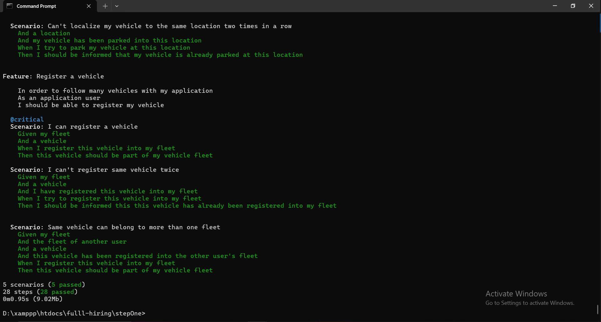

# fulll - Hiring Test

## Algo Test (FizzBuzz)

[https://codesandbox.io/p/devbox/5l2j8g](https://codesandbox.io/p/devbox/5l2j8g)

## Backend (DDD & CQRS Intermédiaire/Sénior)

Tech Stack:
- PHP 8.1
- Behat
- Symfony 6.4 (In Step Two)
- Apache (In Step Two)
- MySQL (In Step Two)
- Docker (In Step Two)

### Step One

This version was built based on the PHP/Boilerplate, no frameworks were used, and the persistence is made in-memory.

#### **Requirements**
To run this project you will need a computer with PHP and composer installed.

#### **Install**
To install the project, you just have to run `composer install` to get all the dependencies

#### **Running the tests**
After installing the dependencies you can run the tests with this command `php vendor/behat/behat/bin/behat`.
The result should look like this :



### Step Two & Three

#### **Install**

#### **1️⃣ Go To Directory**
```bash
cd stepTwoTree
```

#### **2️⃣ Build & Start Services with Docker**
```bash
docker-compose up -d --build
docker exec -it fulll_test_php-fpm bash
```

#### **3️⃣ Install the needed libraries & clear cache**
```bash
composer install
php bin/console c:c
```
-- We need to add the steps about the database
#### **4️⃣ Run Behat**
```bash
php vendor/behat/behat/bin/behat
```

#### **5️⃣ Run PHPStan Analysis**
```bash
vendor/bin/phpstan analyse
```

_And you're ready to go!_